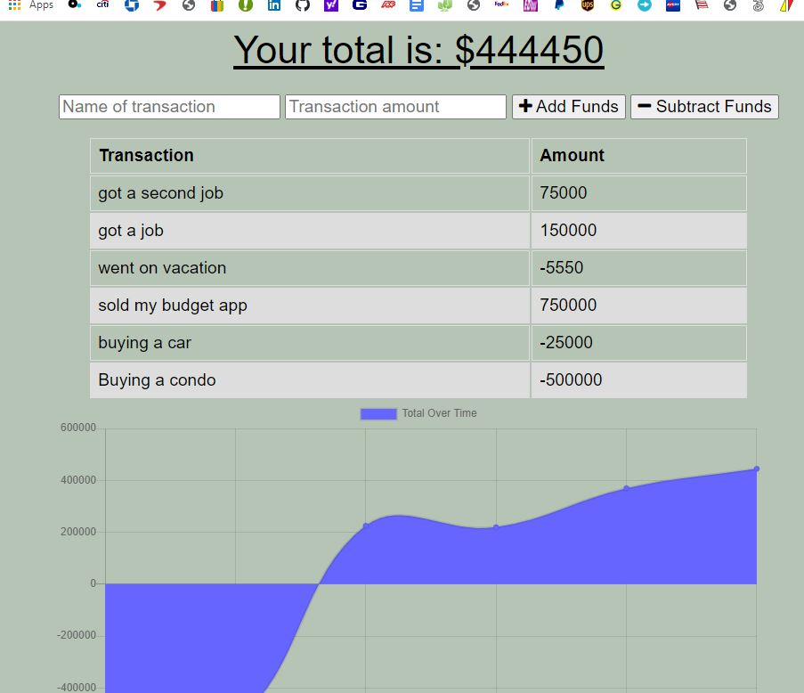
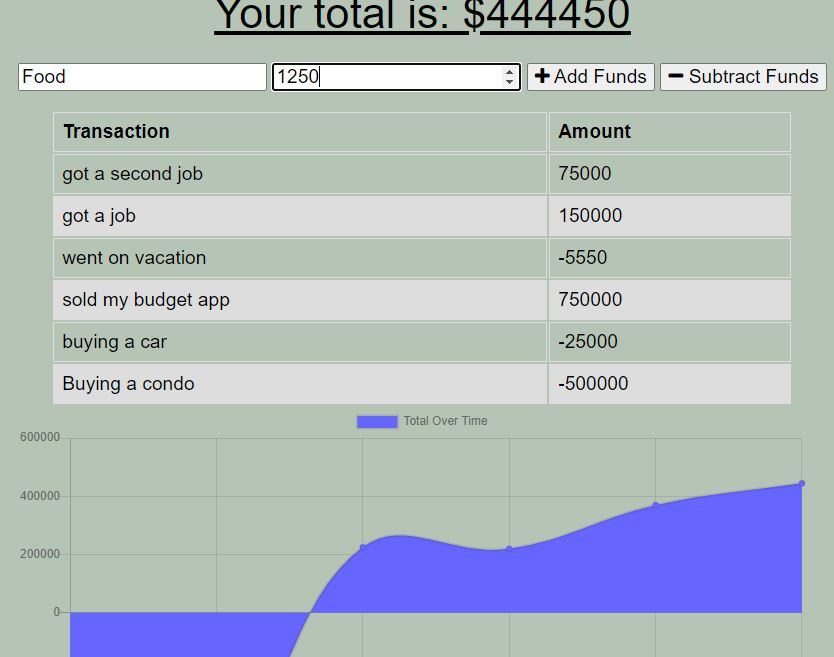

    
# Title : budget-tracker

## Description
Author: Jivko Atanassov

Every web developer needs a budget. Now all can relax, here comes the "budget-tracker"!

Github User name: zhim57

## Table of Contents:
- [Title](#title)
- [Description](#description)
- [Table of Contents](#table-of-contents)
- [Installation](#installation)
- [Usage](#usage)
- [License](#licence)
- [Contributing](#contributing)
- [Tests](#tests)
- [Questions](#questions)

## Installation
he/she will need to start it with "node server"
## Usage
- Node.js  application
great budget tracker that hopefully will not brake your budget....
## Email
zhim57@yahoo.com
## Contributing
functionality test
## License

## Tests
all the team at the bootcamp, instructors, colleagues , thank you all

## Questions
please email Jivko Atanassov with any questions at: zhim57@yahoo.com. Thank You.

## Links

[link to this portfolio](https://github.com/zhim57/budget-tracker)

[link to the deployed application](https://evening-taiga-88021.herokuapp.com/)
  

## Screenshots

  